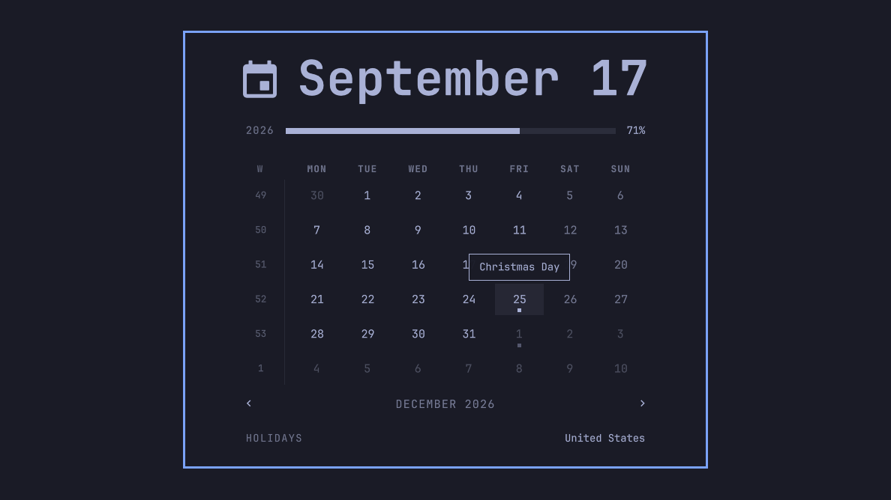

# Omoliday

The Omarchy clock, with your country's public holidays on the calendar.



Omoliday is Omarchy's own clock and calendar with one addition: public
holidays are marked on the month grid. A holiday's number is highlighted with
a dot beneath it, and hovering the day shows its name. The dates come from
[Nager.Date](https://date.nager.at), an open-source holiday database covering
about two hundred countries. Everything else is the stock clock, unchanged.

## Install

```sh
omarchy plugin add https://github.com/badgetobytes/omoliday.git --enable
```

Omoliday takes the stock clock's place in the bar, keeping its position and
settings. If your bar centres on the clock, change `"centerAnchor"` in
`~/.config/omarchy/shell.json` from `omarchy.clock` to `fstander.omoliday`.

```sh
omarchy plugin update fstander.omoliday   # newer versions
omarchy plugin remove fstander.omoliday   # puts the stock clock back
```

No install hooks; the plugin opens no file and asks for no password. It makes
one HTTPS request per calendar year to Nager.Date, described under
[Your data](#your-data), and the only command it ever asks the bar to run is
the stock clock's middle-click timezone picker.

## Holidays

Click the clock to open the calendar. Days with a public holiday carry a dot
under the number; hover one for its name. Years are fetched as you step
through the calendar, so December already shows New Year's Day.

### Country

The rail under the grid names the country whose holidays are marked. Until you
save one it follows the system locale and says so, for example
`United States · from locale`. A machine installed with an `en_US` locale gets
the United States whatever the country, so check it once:

1. Click the rail, or press `c`.
2. Type a two-letter code or the start of a name: `za`, `south a`, `germ`. The
   match shows beside the field.
3. Press Enter to keep it, or Escape to leave things as they were.

An empty field goes back to the locale, and `off` shows no holidays and sends
no requests. The same setting can be written from a terminal, and countries
with regional holidays can add one subdivision; nationwide holidays always
show:

```sh
omarchy bar set fstander.omoliday country ZA
omarchy bar set fstander.omoliday region DE-BY   # Bavaria
```

### Refresh

A year is fetched once and reused for thirty days. A failed fetch, offline or
for a country the source does not have, is retried after a quarter of an hour,
then an hour, then every six hours, while the cached years keep showing.

```sh
omarchy-shell fstander.omoliday holidays          # current state as JSON
omarchy-shell fstander.omoliday refetchHolidays   # drop the cache and ask again
```

## Clock

| Action | Effect |
| --- | --- |
| Left click | Open or close the calendar |
| Right click | Cycle the label format |
| Middle click | Open the timezone picker |
| Scroll on the grid | Previous or next month |
| Left / Right, `[` / `]` | Previous or next month |
| Up / Down, `{` / `}` | Previous or next year |
| `t` or Enter | Back to today |
| `w` or click the W heading | Start weeks on Monday or Sunday |
| `c` or click the holidays rail | Choose the country |
| Double-tap the year bar | Set a birth year for the life bar |
| Escape | Close |

All of it is the stock clock's behaviour. The label format can also be set
directly (`omarchy bar set fstander.omoliday format "HH:mm"`), and the
timezone picker runs Omarchy's own `omarchy-menu-timezone`, exactly as the
stock clock does.

## Themes

The panel follows the active Omarchy palette and repaints on a theme switch.
The holiday mark uses the theme's selected-state colour, the same one the year
bar fills with. No theme files are installed.

## Your data

The widget's entry in `~/.config/omarchy/shell.json` holds its settings
(`country`, `region`, the clock's formats) and a `records` object with the
cached holidays: at most three years of dates and names, under 16 KiB, written
through the shell's plugin settings API. Removing the plugin restores the stock
clock's entry; the cached years stay on it until the entry is edited.

Each fetch is a single `GET https://date.nager.at/api/v3/PublicHolidays/<year>/<country>`
with no headers, cookies or identifiers beyond what any HTTPS request carries.
The response is capped at 64 KiB and cut off past that, a redirect is refused,
every field is validated before use, and nothing else is ever requested. With
several monitors the bar mounts the widget once per monitor; only one copy
fetches, and the others show what it saves.

## Read more

- [Design notes](docs/design.md): the data source, the cache and retry policy,
  and how the network path is bounded.
- [Development](docs/development.md): running the gate, installing from a
  checkout, inspecting the state over shell IPC.

## License and credits

MIT, see [LICENSE](LICENSE). The clock, calendar and date model are Omarchy's
own clock plugin, MIT, copyright David Heinemeier Hansson, carried here with
the holiday work added; see [NOTICE](NOTICE). Holiday data is served by
[Nager.Date](https://github.com/nager/Nager.Date) (MIT). Tested on Omarchy
4.0.4 with Qt 6.11.
